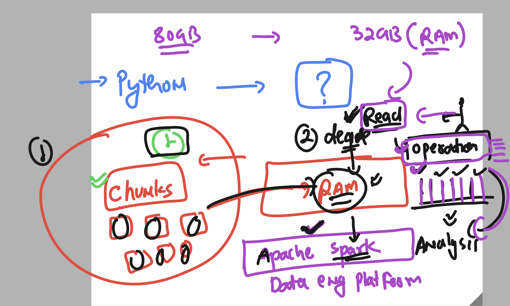
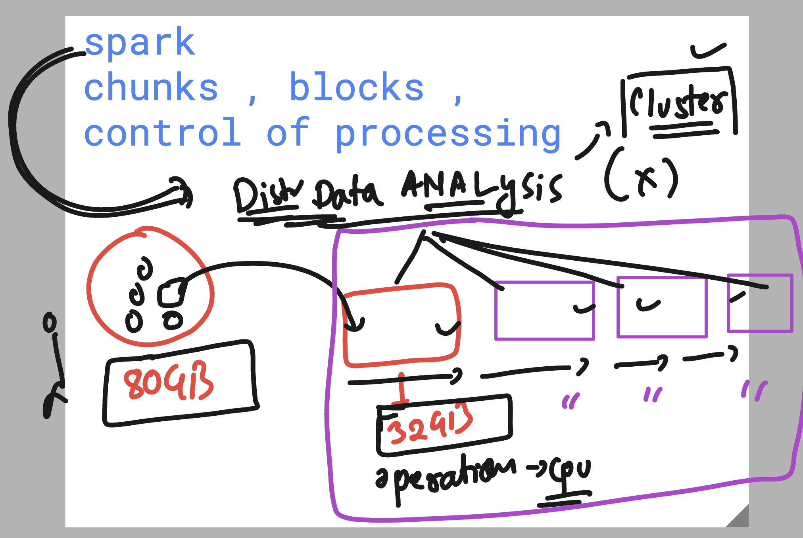
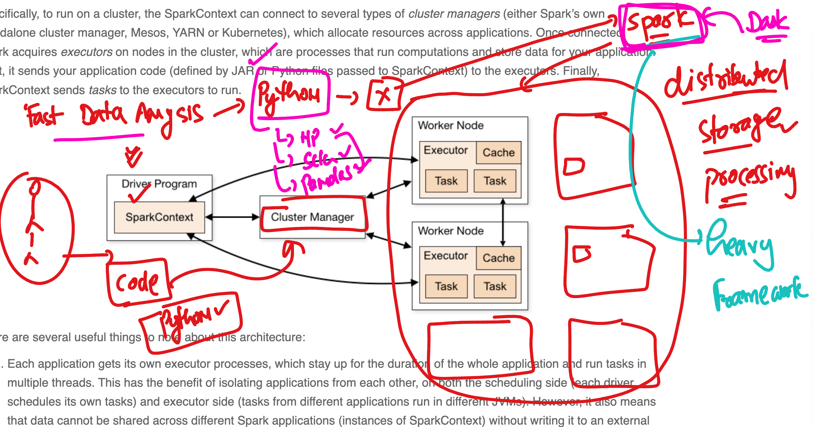

# Python to Spark 

### To Do Fast Processing of Data 

### Python to Spark - to Dask 

# Dask Info 

Dask is a flexible, open-source library for parallel computing in Python. It is designed to scale Python code from single machines to large clusters, enabling efficient handling of larger-than-memory datasets and parallelizing computations. Dask integrates seamlessly with the Python ecosystem, including libraries like NumPy, pandas, and scikit-learn.

## Key Features

- **Parallel Computing**: Dask breaks down large computations into smaller tasks and executes them in parallel, leveraging multi-core CPUs or distributed clusters.
- **Scalability**: Works on a single machine or scales to thousands of nodes in a distributed cluster.
- **Familiar APIs**: Provides APIs that mimic popular libraries like:
    - `dask.array` for NumPy-like arrays.
    - `dask.dataframe` for pandas-like DataFrames.
    - `dask.bag` for processing semi-structured data (like JSON).
    - `dask.delayed` for custom parallel workflows.
- **Lazy Evaluation**: Computations are not executed immediately but are instead built into a task graph, which is optimized and executed later.
- **Out-of-Core Computation**: Handles datasets larger than memory by efficiently streaming data from disk.
- **Integration**: Works well with other Python libraries like NumPy, pandas, scikit-learn, and XGBoost.

## When to Use Dask?

- Your dataset is too large to fit into memory.
- You need to parallelize computations across multiple cores or machines.
- You want to scale pandas, NumPy, or custom Python workflows without rewriting code.
- You’re working with distributed systems or clusters (e.g., Kubernetes, Hadoop, or cloud environments).

## Core Components

- **Dask Scheduler**: Coordinates tasks across workers.
- **Dask Workers**: Execute tasks in parallel.
- **Dask Client**: Interface for users to interact with the scheduler and workers.
- **Task Graph**: A directed acyclic graph (DAG) that represents the computation.

## Example Use Cases

- **Large-Scale Data Analysis**: Process terabytes of data using `dask.dataframe`.
- **Machine Learning**: Scale scikit-learn workflows with `dask_ml`.
- **Custom Workflows**: Use `dask.delayed` to parallelize custom Python functions.
- **Distributed Computing**: Run computations on clusters using Dask’s distributed scheduler.