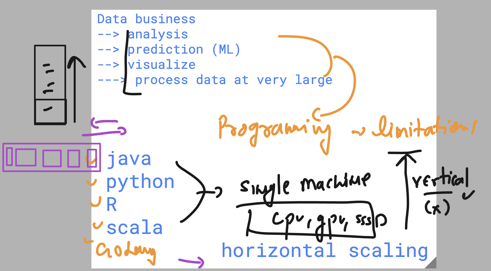
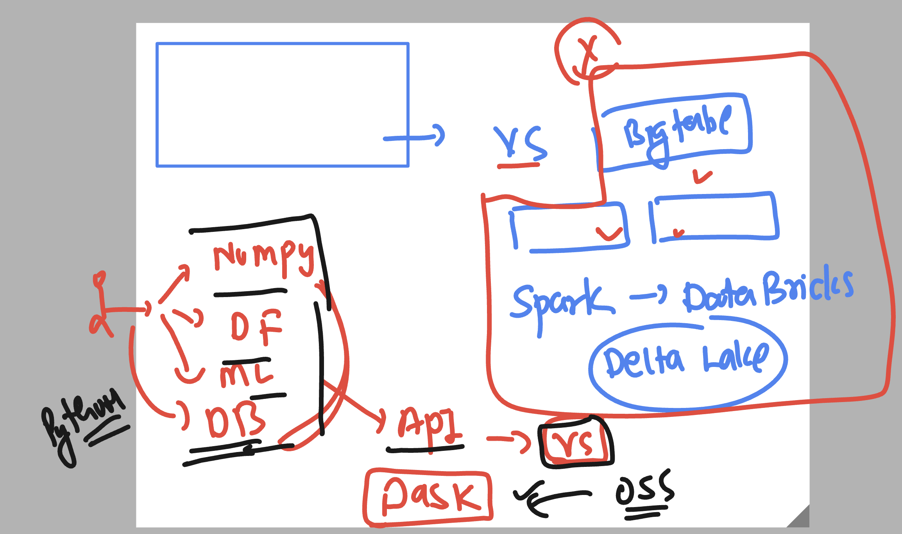
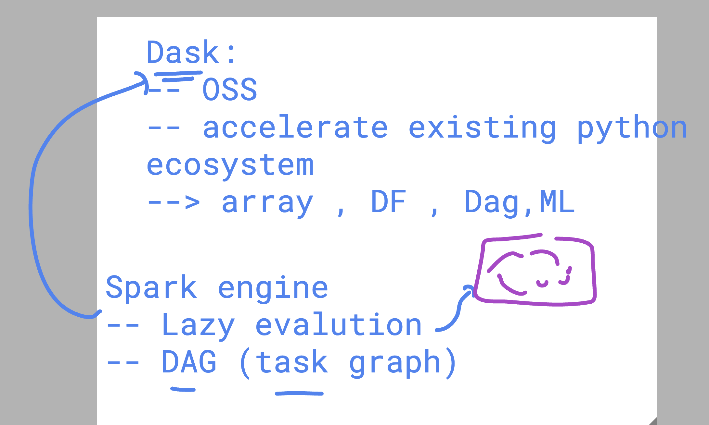
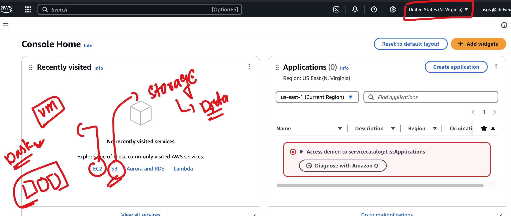
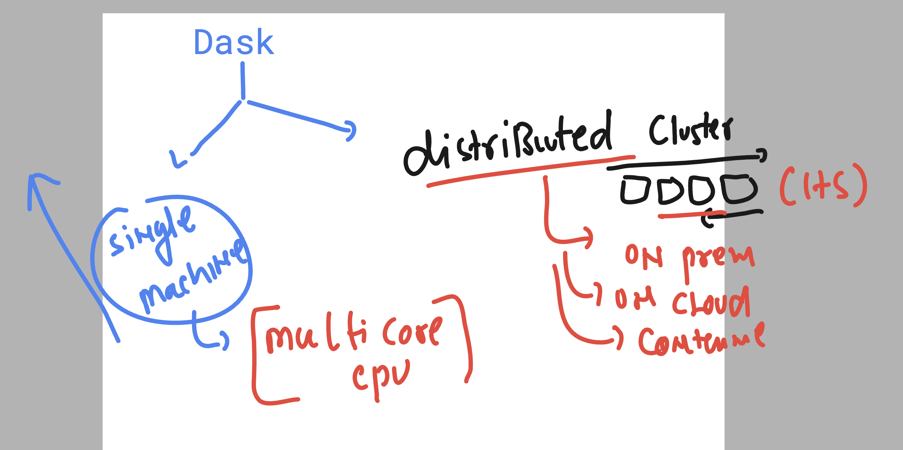
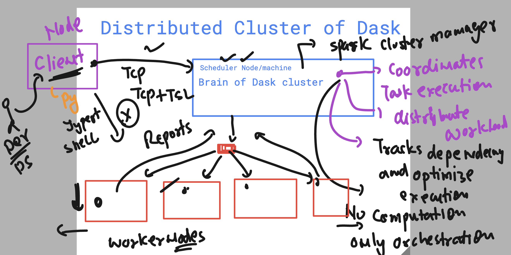
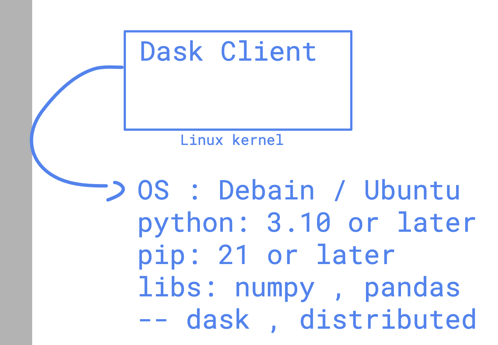

### Revision 

### World of Horizental scaling 



### Dask 



### More dask info 



### aws cloud services 



### Understanding Dask Cluster 



### Dask Cluster Components 



## dask Client info 



### Verify Dask client details 

```
ubuntu@dask-client:~$ pip -V
pip 24.0 from /usr/lib/python3/dist-packages/pip (python 3.12)
ubuntu@dask-client:~$ 
ubuntu@dask-client:~$ 
ubuntu@dask-client:~$ uname 
Linux
ubuntu@dask-client:~$ 
ubuntu@dask-client:~$ python3 -V
Python 3.12.3
ubuntu@dask-client:~$ 
ubuntu@dask-client:~$ pip -V
pip 24.0 from /usr/lib/python3/dist-packages/pip (python 3.12)
ubuntu@dask-client:~$ 
ubuntu@dask-client:~$ 
ubuntu@dask-client:~$ pip  list  | grep -i numpy 
ubuntu@dask-client:~$ 
ubuntu@dask-client:~$ ls
client  jupyterhub.sqlite  jupyterhub_config.py.backup  jupyterhub_cookie_secret
ubuntu@dask-client:~$ source client/bin/activate
(client) ubuntu@dask-client:~$ 
(client) ubuntu@dask-client:~$ pip  list  | grep -i numpy 
numpy                     2.2.3
(client) ubuntu@dask-client:~$ pip  list  | grep -i pandas
pandas                    2.2.3
(client) ubuntu@dask-client:~$ pip  list  | grep -i dask
dask                      2025.2.0
dask_labextension         7.0.0
(client) ubuntu@dask-client:~$ pip  list  | grep -i distri
distributed               2025.2.0
(client) ubuntu@dask-client:~$ 

```