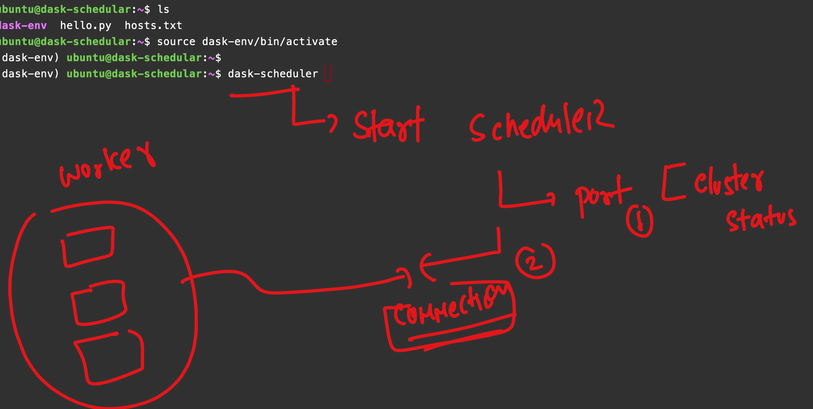
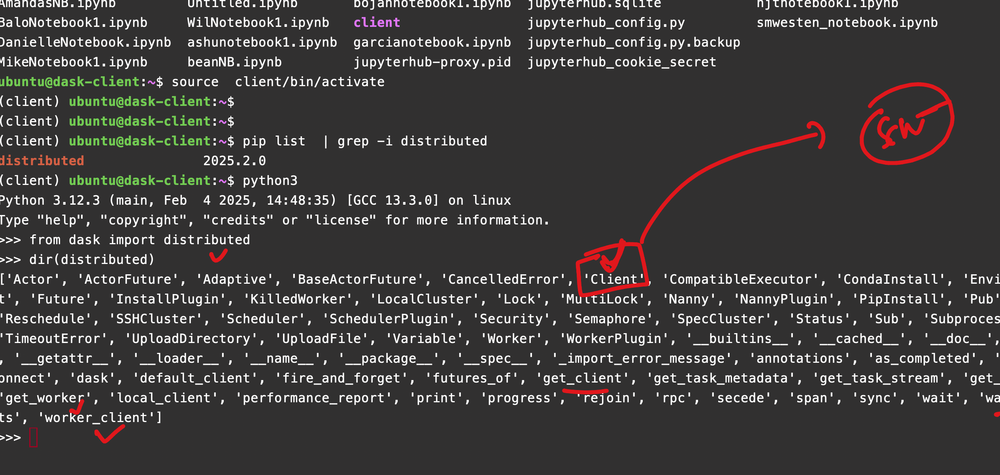
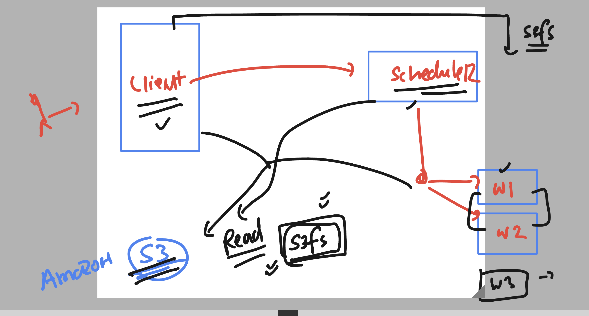
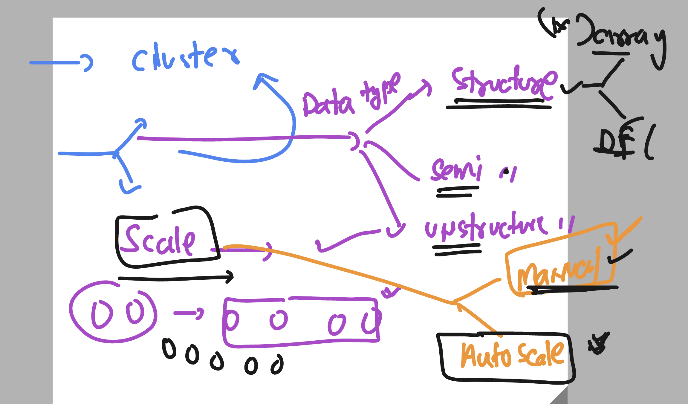

### Revision 

### World of Horizental scaling 


### Dask 


### More dask info 


### aws cloud services 


### Understanding Dask Cluster 


### Dask Cluster Components 


## dask Client info 


### Verify Dask client details 

```
ubuntu@dask-client:~$ pip -V
pip 24.0 from /usr/lib/python3/dist-packages/pip (python 3.12)
ubuntu@dask-client:~$ 
ubuntu@dask-client:~$ 
ubuntu@dask-client:~$ uname 
Linux
ubuntu@dask-client:~$ 
ubuntu@dask-client:~$ python3 -V
Python 3.12.3
ubuntu@dask-client:~$ 
ubuntu@dask-client:~$ pip -V
pip 24.0 from /usr/lib/python3/dist-packages/pip (python 3.12)
ubuntu@dask-client:~$ 
ubuntu@dask-client:~$ 
ubuntu@dask-client:~$ pip  list  | grep -i numpy 
ubuntu@dask-client:~$ 
ubuntu@dask-client:~$ ls
client  jupyterhub.sqlite  jupyterhub_config.py.backup  jupyterhub_cookie_secret
ubuntu@dask-client:~$ source client/bin/activate
(client) ubuntu@dask-client:~$ 
(client) ubuntu@dask-client:~$ pip  list  | grep -i numpy 
numpy                     2.2.3
(client) ubuntu@dask-client:~$ pip  list  | grep -i pandas
pandas                    2.2.3
(client) ubuntu@dask-client:~$ pip  list  | grep -i dask
dask                      2025.2.0
dask_labextension         7.0.0
(client) ubuntu@dask-client:~$ pip  list  | grep -i distri
distributed               2025.2.0
(client) ubuntu@dask-client:~$ 

```

### Scheduler details 



### starting scheduler 

```
 systemctl status dask-scheduler.service 
○ dask-scheduler.service - Dask Scheduler
     Loaded: loaded (/etc/systemd/system/dask-scheduler.service; disabled; preset: enabled)
     Active: inactive (dead)
(dask-env) ubuntu@dask-schedular:~$ sudo systemctl start dask-scheduler.service 
(dask-env) ubuntu@dask-schedular:~$ systemctl status dask-scheduler.service 
● dask-scheduler.service - Dask Scheduler
     Loaded: loaded (/etc/systemd/system/dask-scheduler.service; disabled; preset: enabled)
     Active: active (running) since Tue 2025-03-04 18:07:12 UTC; 3s ago
   Main PID: 1049 (dask-scheduler)
      Tasks: 3 (limit: 9507)
     Memory: 86.0M (peak: 86.2M)
        CPU: 1.070s
     CGroup: /system.slice/dask-scheduler.service

```

### FRom client Node -- to connect Scheduler we gonna use 



### reading data from s3 for faster read method and lower latency in case of AWS based dask cluster 



### finding out cluster details and worker info 

```
 from dask.distributed import Client
>>> client = Client("tcp://172.31.36.115:8786")
>>> 
>>> client.scheduler_info().keys()
dict_keys(['type', 'id', 'address', 'services', 'started', 'workers'])
>>> 
>>> client.scheduler_info()['workers'].keys()
dict_keys(['tcp://172.31.46.116:39567', 'tcp://172.31.46.3:42927'])
>>> 

```

## scaling worker in dask cluster 



### On new machine terminal 

```
sudo apt update
sudo apt install python3-venv 
python3 -m venv ashu-env 

===>
ubuntu@ip-172-31-39-84:~$  python3 -m venv ashu-env 
ubuntu@ip-172-31-39-84:~$ ls
ashu-env
ubuntu@ip-172-31-39-84:~$ source ashu-env/bin/activate
(ashu-env) ubuntu@ip-172-31-39-84:~$ 

pip install numpy pandas dask distributed  s3fs 

```

## Creating start file of worker 

### checking location of worker binary 

```
which dask-worker 
/home/ubuntu/ashu-env/bin/dask-worker
(ashu-env) ubuntu@ip-172-31-39-84:~$ 

===>
sudo systemctl daemon-reload 
(ashu-env) ubuntu@ip-172-31-39-84:~$ sudo systemctl start dask-worker
(ashu-env) ubuntu@ip-172-31-39-84:~$ sudo systemctl status  dask-worker
```

### dask-worker.service -- content 

```
[Unit]
Description=Dask Scheduler
After=network.target


[Service]
User=ubuntu
WorkingDirectory=/home/ubuntu
ExecStart=/home/ubuntu/dask-env/bin/dask-worker tcp://172.31.36.115:8786
Restart=always
RestartSec=5


[Install]
WantedBy=multi-user.target
```


