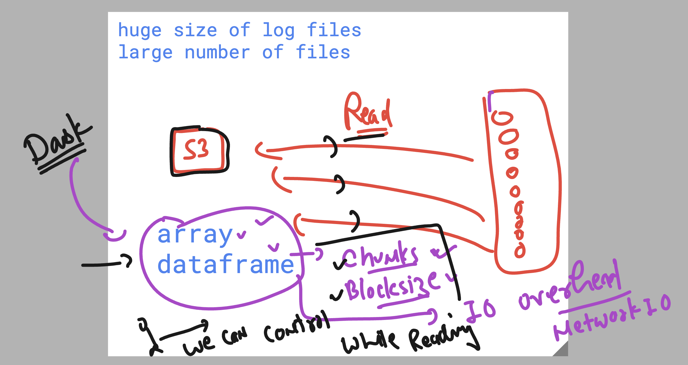
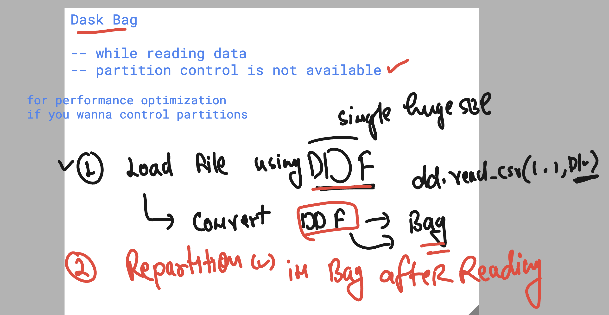
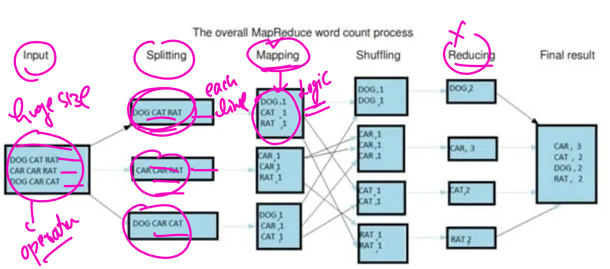
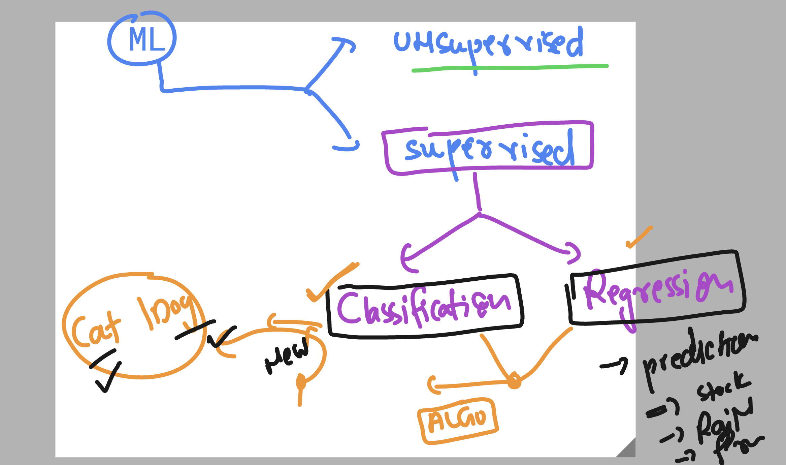
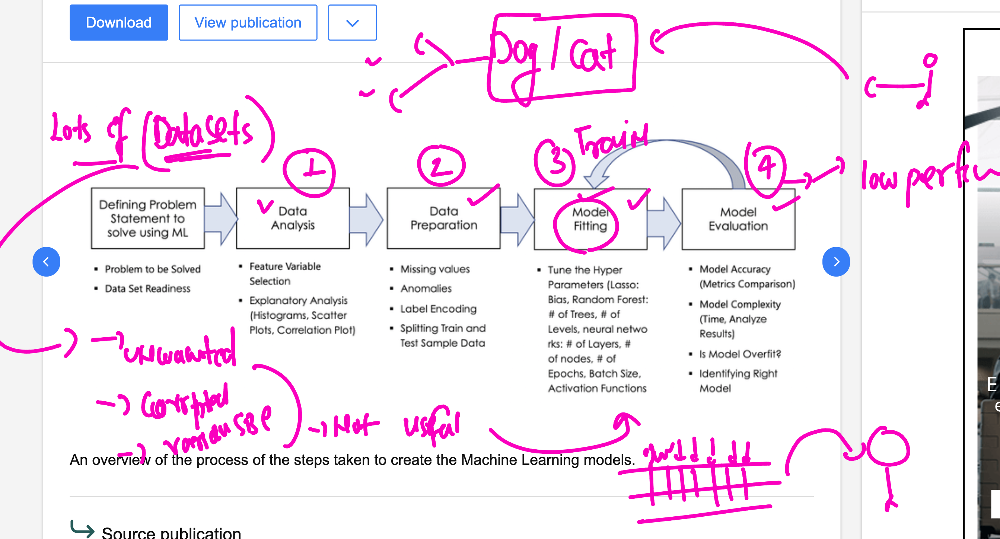
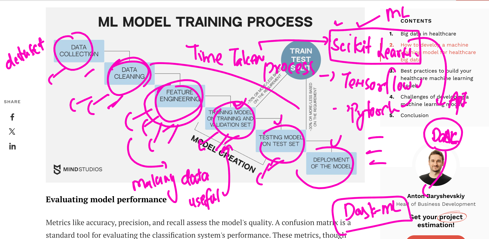

### revision 


### info about dask bags 


### making dask-worker auto start on system boot 

```sh
sudo systemctl  status  dask-worker
○ dask-worker.service - Dask Scheduler
     Loaded: loaded (/etc/systemd/system/dask-worker.service; disabled; preset: enabled)
     Active: inactive (dead)

ubuntu@ip-172-31-39-84:~$ 
ubuntu@ip-172-31-39-84:~$ 
ubuntu@ip-172-31-39-84:~$ sudo systemctl  start  dask-worker

ubuntu@ip-172-31-39-84:~$ sudo systemctl  status  dask-worker
● dask-worker.service - Dask Scheduler
     Loaded: loaded (/etc/systemd/system/dask-worker.service; disabled; preset: enabled)
     Active: active (running) since Wed 2025-03-05 16:35:36 UTC; 1s ago
   Main PID: 1336 (dask-worker)
      Tasks: 10 (limit: 2336)
     Memory: 131.9M (peak: 132.1M)
        CPU: 1.100s
     CGroup: /system.slice/dask-worker.service
             ├─1336 /home/ubuntu/ashu-env/bin/python3 /home/ubuntu/ashu-env/bin/dask-worker tcp://172.31.36.115:8786
             ├─1338 /home/ubuntu/ashu-env/bin/python3 -c "from multiprocessing.resource_tracker import main;main(10)"
             └─1341 /home/ubuntu/ashu-env/bin/python3 -c "from multiprocessing.spawn import spawn_main; spawn_main(tracker_fd=11, pipe_handle=17)" --multipro>

Mar 05 16:35:37 ip-172-31-39-84 dask-worker[1336]: 2025-03-05 16:35:37,105 - distributed.nanny - INFO -         Start Nanny at: 'tcp://172.31.39.84:38685'
Mar 05 16:35:37 ip-172-31-39-84 dask-worker[1341]: 2025-03-05 16:35:37,674 - distributed.worker - INFO -       Start worker at:   tcp://172.31.39.84:44531
Mar 05 16:35:37 ip-172-31-39-84 dask-worker[1341]: 2025-03-05 16:35:37,675 - distributed.worker - INFO -          Listening to:   tcp://172.31.39.84:44531
Mar 05 16:35:37 ip-172-31-39-84 dask-worker[1341]: 2025-03-05 16:35:37,675 - distributed.worker - INFO -          dashboard at:         172.31.39.84:45855
Mar 05 16:35:37 ip-172-31-39-84 dask-worker[1341]: 2025-03-05 16:35:37,675 - distributed.worker - INFO - Waiting to connect to:   tcp://172.31.36.115:8786
Mar 05 16:35:37 ip-172-31-39-84 dask-worker[1341]: 2025-03-05 16:35:37,675 - distributed.worker - INFO - -------------------------------------------------
Mar 05 16:35:37 ip-172-31-39-84 dask-worker[1341]: 2025-03-05 16:35:37,675 - distributed.worker - INFO -               Threads:                          1
Mar 05 16:35:37 ip-172-31-39-84 dask-worker[1341]: 2025-03-05 16:35:37,675 - distributed.worker - INFO -                Memory:                   1.92 GiB
Mar 05 16:35:37 ip-172-31-39-84 dask-worker[1341]: 2025-03-05 16:35:37,675 - distributed.worker - INFO -       Local Directory: /tmp/dask-scratch-space/worke>
Mar 05 16:35:37 ip-172-31-39-84 dask-worker[1341]: 2025-03-05 16:35:37,675 - distributed.worker - INFO - -------------------------------------------------


ubuntu@ip-172-31-39-84:~$ sudo systemctl  enable   dask-worker
Created symlink /etc/systemd/system/multi-user.target.wants/dask-worker.service → /etc/systemd/system/dask-worker.service.

```

### Doing filter operations in unstructure data in Distributed dask cluster


### to improve performance of  large dataset in dask array and DF we use given concepts



### partitions in dask bag for making performance improvement 


### For better performance and calculations if you want to control partitions 



### Map reduce operations in Bigdata 



### Introduction to Basic ML 




### Basic Model creation flow 




### out of many ML based python framework / libs DASk is supporting scikit-learn



### Installing required Lib for ML support in dask in all the machines 
### client , scheduler , workers

```sh
 pip install dask-ml 

 ===>
 (ashu-env) ubuntu@ip-172-31-39-84:~$ pip list | grep dask 
dask             2025.2.0
dask-glm         0.3.2
dask-ml          2025.1.0
(ashu-env) ubuntu@ip-172-31-39-84:~$ pip list | grep scikit-learn 
scikit-learn     1.6.1
(ashu-env) ubuntu@ip-172-31-39-84:~$ 
```
