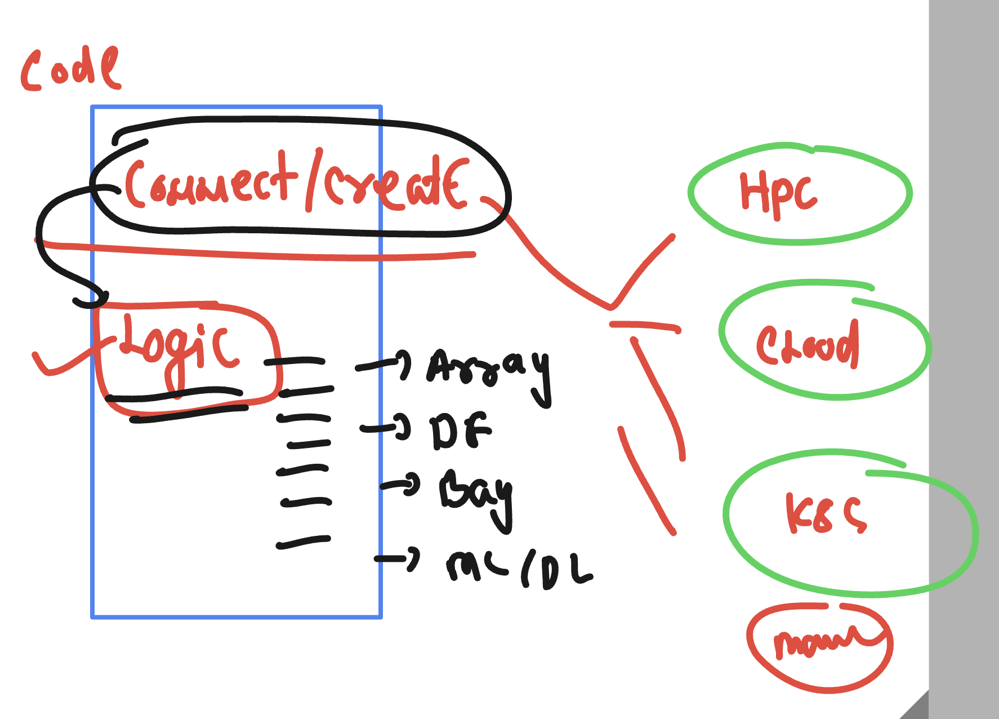
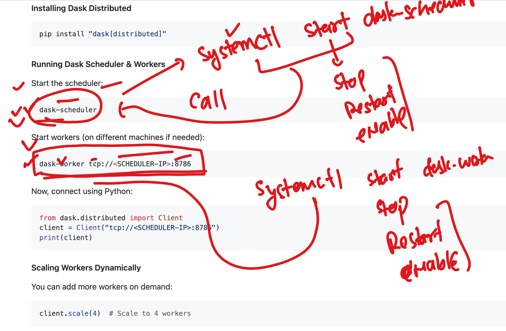
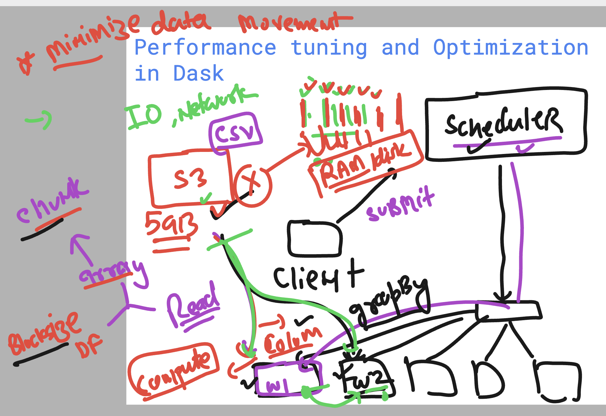

# Dask cluster Revision 

```
from dask.distributed import LocalCluster
cluster = LocalCluster() # fully featured local dask cluster
```

### info about Dask cluster for data reading 


### code mind of dask with various cluster options 



### Dask service with systemctl understanding 



## Performance optimization of Network / IO and DISk 

### incase of reading data from external source like s3/gfs/HDFS 
## generally intermediate opeartions are reading data multiple times 



### COpy vs Mount 


### Mounting nfs storage to your personal workers

```
shu-env
ubuntu@ip-172-31-39-84:~$ sudo apt install nfs-common 
Reading package lists... Done
Building dependency tree... Done
Reading state information... Done
nfs-common is already the newest version (1:2.6.4-3ubuntu5.1).
0 upgraded, 0 newly installed, 0 to remove and 93 not upgraded.
ubuntu@ip-172-31-39-84:~$ 
ubuntu@ip-172-31-39-84:~$ sudo showmount -e 172.31.36.41
Export list for 172.31.36.41:
/mnt/nfs_share/logs *
ubuntu@ip-172-31-39-84:~$ ls
ashu-env
ubuntu@ip-172-31-39-84:~$ mkdir logs
ubuntu@ip-172-31-39-84:~$ ls
ashu-env  logs
ubuntu@ip-172-31-39-84:~$ ls logs/
ubuntu@ip-172-31-39-84:~$ 
ubuntu@ip-172-31-39-84:~$ sudo mount 172.31.36.41:/mnt/nfs_share/logs  /home/ubuntu/logs/
ubuntu@ip-172-31-39-84:~$ 
ubuntu@ip-172-31-39-84:~$ ls logs/
log1.txt  log2.txt  log3.txt
ubuntu@ip-172-31-39-84:~$ 

```
