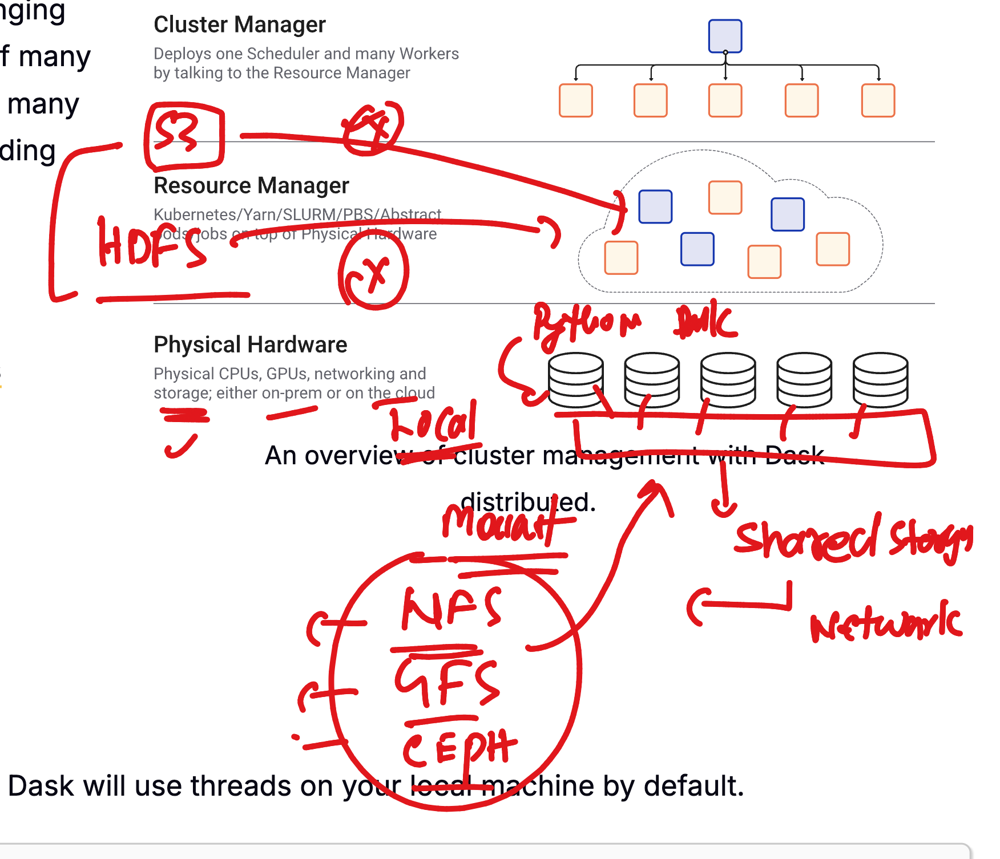

# Dask cluster Revision 

```
from dask.distributed import LocalCluster
cluster = LocalCluster() # fully featured local dask cluster
```

### info about Dask cluster for data reading 




### code mind of dask with various cluster options 

<img src="rev2.png"

### Dask service with systemctl understanding 

<img src="rev3.png"